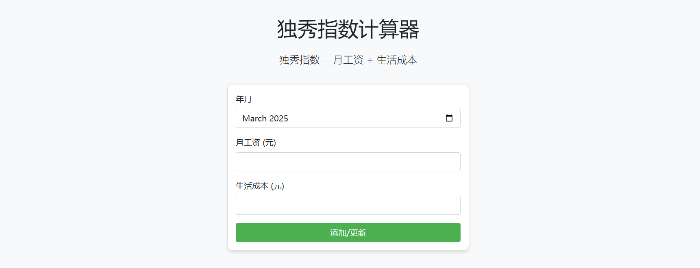
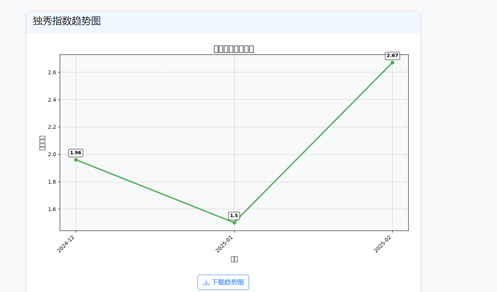
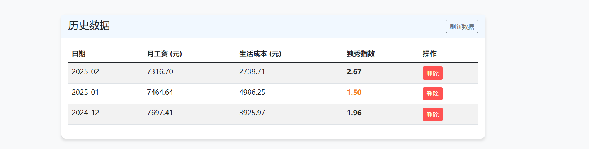

# 独秀指数计算器 (Duxiu Index Calculator)

这是一个用于计算个人财务"独秀指数"的Web应用，帮助您跟踪收入与生活成本之间的关系。

## 什么是独秀指数？

独秀指数是衡量个人财务健康的一个简单指标，计算公式为：

```
独秀指数 = 月工资 ÷ 生活成本
```

该指数反映了您的收入与生活成本之间的比例关系：
- 指数 ≥ 2: 优秀（财务状况非常健康）
- 1 ≤ 指数 < 2: 良好（财务状况稳定）
- 指数 < 1: 欠佳（财务压力较大）

## 功能特性

- 用户注册和登录系统
- 每个用户独立的数据存储空间
- 记录月度收入和生活成本
- 自动计算独秀指数
- 生成直观的趋势图表
- 下载趋势图功能
- 查看和管理历史数据

# 运行截图









## 技术栈

- 后端: Python Flask
- 用户认证: Flask-Login
- 表单处理: Flask-WTF, WTForms
- 前端: HTML, CSS, JavaScript, Bootstrap 5
- 数据可视化: Matplotlib
- 数据存储: JSON文件

## 安装指南

### 前提条件

- Python 3.6+ 安装
- pip 包管理器

### 步骤

1. **克隆仓库**

```bash
git clone https://github.com/WLH55/duxiu_index_app.git
```

2. **创建并激活虚拟环境** (可选但推荐)

在Windows上:
```bash
python -m venv .venv
.venv\Scripts\activate
```

在macOS/Linux上:
```bash
python3 -m venv .venv
source .venv/bin/activate
```

3. **安装依赖**

```bash
pip install -r duxiu_index_app/requirements.txt
```

## 运行应用

1. **启动Flask应用**

```bash
cd duxiu_index_app
python app.py
```

2. **访问应用**

打开浏览器，访问:
```
http://127.0.0.1:5000
```

## 使用说明

1. **用户注册与登录**
   - 首次使用时，点击"注册"创建新账户
   - 使用您的用户名和密码登录
   - 每个用户的数据相互独立，不会相互影响

2. **记录与查看数据**
   - 在表单中输入年月、月工资和生活成本
   - 点击"添加/更新"按钮保存数据
   - 查看自动生成的独秀指数趋势图
   - 可以点击"下载趋势图"按钮保存图表
   - 在历史数据表格中查看和管理已记录的数据

## 数据存储

所有数据保存在应用的`data`目录中：
- 用户信息存储在`data/users.json`文件中
- 独秀指数记录存储在`data/records.json`文件中

您可以备份这些文件以保留所有用户的历史记录。

## 部署到服务器

要将应用部署到Ubuntu服务器，请参考以下步骤：

1. **准备服务器环境**
```bash
sudo apt update
sudo apt upgrade -y
sudo apt install -y python3 python3-pip python3-venv git nginx
```

2. **获取代码并设置**
```bash
cd /opt
sudo git clone https://github.com/您的用户名/duxiu_index_app.git
sudo chown -R ubuntu:ubuntu /opt/duxiu_index_app
cd duxiu_index_app
python3 -m venv venv
source venv/bin/activate
pip install -r requirements.txt
pip install gunicorn
```

3. **设置Gunicorn服务**
```bash
sudo nano /etc/systemd/system/duxiu.service
```

添加以下内容（替换用户名）：
```
[Unit]
Description=Gunicorn instance to serve duxiu_index_app
After=network.target

[Service]
User=ubuntu
Group=ubuntu
WorkingDirectory=/opt/duxiu_index_app
Environment="PATH=/opt/duxiu_index_app/venv/bin"
ExecStart=/opt/duxiu_index_app/venv/bin/gunicorn --workers 3 --bind 0.0.0.0:5000 app:app

[Install]
WantedBy=multi-user.target
```

4. **配置Nginx反向代理**
详细部署说明请参考文档中的部署章节。

## 许可证

MIT License

## 贡献

欢迎提交问题和改进建议！
